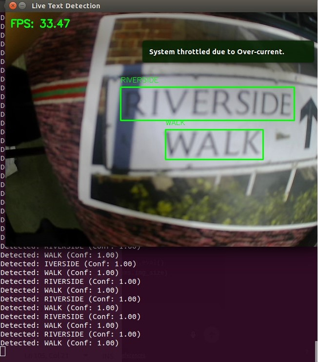
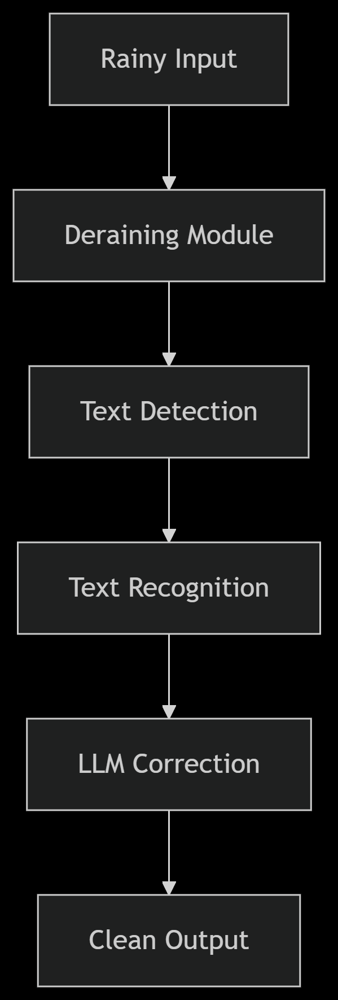
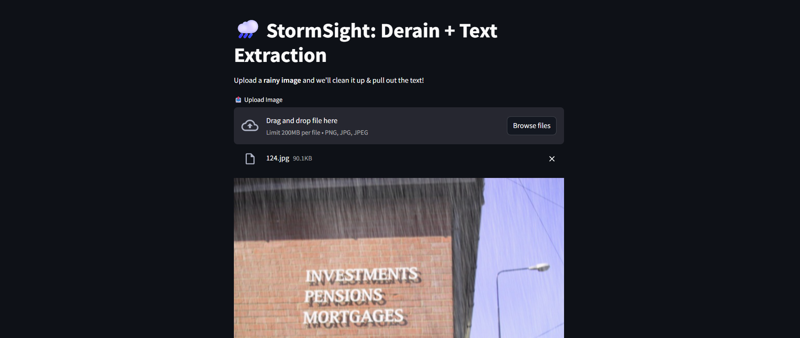

# 🌧️ StormSight: Robust Scene Text Recognition in Adverse Weather  
*An End-to-End Pipeline for Deraining → Detection → OCR*  

  
*Live processing of rainy scene text (Desktop/Jetson compatible)*  

## 🚀 Key Features  
- **Multi-Stage Pipeline**:  
  - 🌧️ **Rain Removal**: Restormer model
  - 🔍 **Text Detection**: CRAFT detector with geometric filtering  
  - 🔠 **Text Recognition**: PARSeq transformer OCR  
  - 🤖 **LLM Enhancement**: Optional Gemini 2.0 Flash post-processing  

- **Multiple Interfaces**:  
  - 🖥️ **Web UI** (Streamlit) for static images  
  - 🎥 **Live Processing** (Jetson/OpenCV)  

## 📂 Project Architecture  
  

## 🛠️ Installation  

### Prerequisites  
- Python 3.11 (3.6.9 for Jetson)  
- NVIDIA Jetson Nano (Optional for edge deployment)  

### Setup  
```bash
git clone https://github.com/Bhupesh-Khordia/StormSight
cd StormSight

# Create environment (Recommended)
python -m venv venv
source venv/bin/activate  # Linux/MacOS
.\venv\Scripts\activate   # Windows

# Install core dependencies
pip install -r requirements/base.txt  # or requirements/jetson.txt for edge devices

# Download pretrained models
bash scripts/download_models.sh
```

## 💻 Usage Options  

### 1. Web Interface (Streamlit)  
```bash
cd src/core
streamlit run ../../frontend/app.py
```
  
*Features drag-n-drop processing and side-by-side comparisons*

### 2. Command Line  
```bash
# Single image processing
cd src/core
python pipeline.py

# Live camera processing (Jetson)
cd src_jetson/core
python text_detection_live.py
```

*Tested by adding synthetic rain to ICDAR-2013 dataset*

## 📝 Academic Context  
**Developed for IC201P Design Practicum at IIT Mandi**  
**Team**:  
- Anshul Mendiratta  
- Bhupesh Yadav  